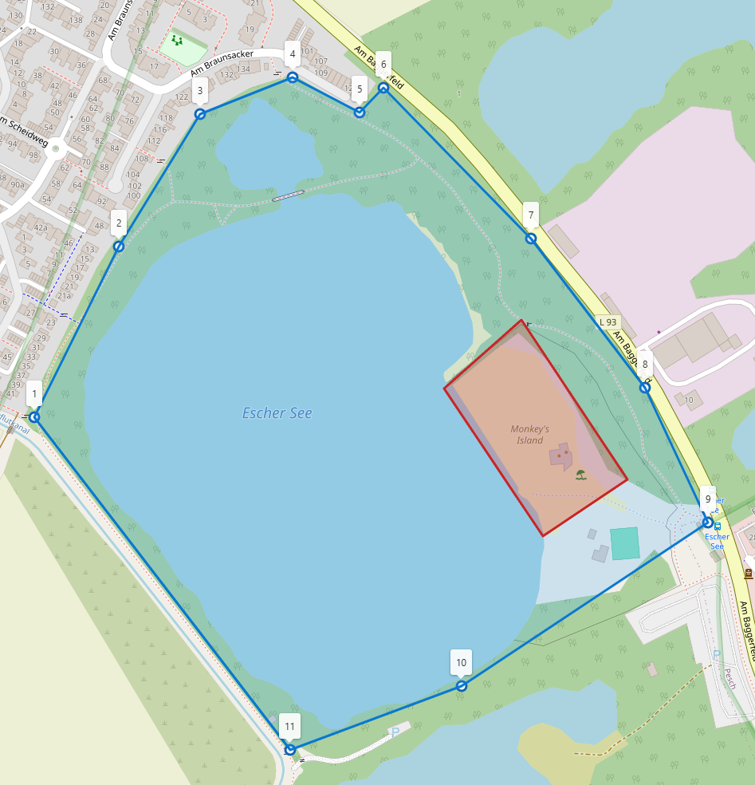
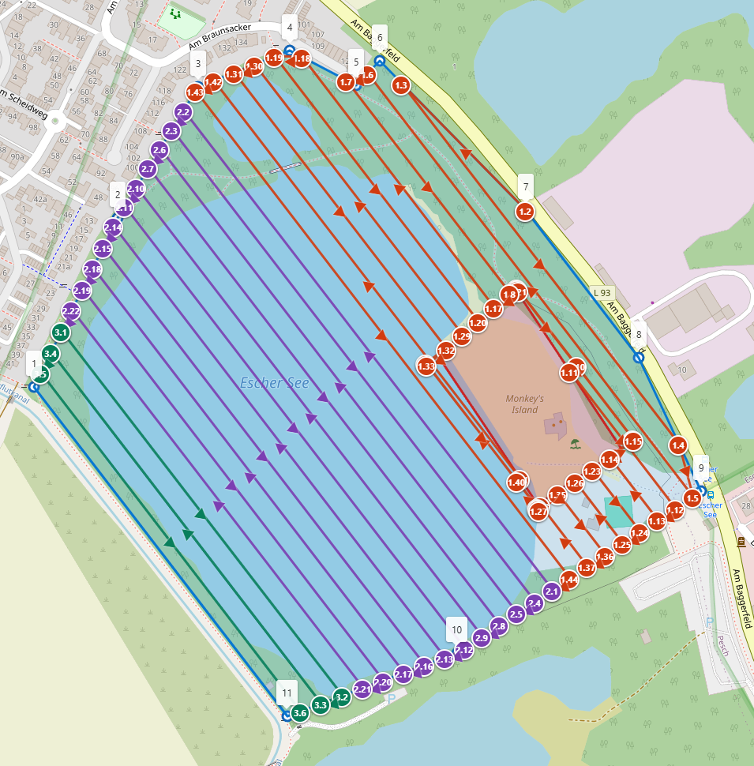

# ACMP – Aerial Capture Mission Planner

ACMP is a desktop tool for drawing mapping areas on an interactive map, planning coverage routes, and exporting DJI WPML/KMZ missions.

> **Early version:** ACMP currently focuses on core area drawing, coverage-route planning, and DJI mission export.

<p float="left">
    
    
</p>

## Key Features

- Create flight areas as polygons, rectangles, or circles.
- Add multiple no-fly zones inside a mapping area.
- Configure essential flight settings such as altitude, speed, path spacing, and route direction.
- Set mission limits for maximum waypoints and flight duration.
- Automatically split large routes into multiple missions when limits are exceeded.
- Configure camera actions and photo spacing for photogrammetry workflows.
- Show official **Germany-only** UAS geozones and inspect affected areas before route planning.
- Highlight or exclude individual geozone conflicts, including clipped intersection areas.
- Show selected Germany-wide protected-area layers as local-rule hints; these are not blanket no-fly zones.

## Start

```powershell
py -3.12 -m pip install -r requirements.txt
py -3.12 main.py
```

The map and address search require an internet connection.

## Usage

1. In **Plan Flight Area**, search for an address or use your current location.
2. Draw the flight area as a polygon, rectangle, or circle.
3. Add red no-fly zones where the drone must not fly.
4. Optionally enable **Germany-only** UAS geozones or local-rule hints, then use the map inspection buttons to identify areas at a point.
5. In **Flight Settings**, choose altitude, speed, path spacing, direction, camera action, and mission limits. Settings are restored automatically on the next start.
6. Generate the route and inspect its waypoints on the map.
7. Save the editable project from **File → Save As** when you want to continue later.
8. Export the planned mission as a DJI-compatible KMZ file from **Export**.

## DJI RC Import Workflow

1. On the RC controller, create and save a simple placeholder waypoint mission first. DJI Fly creates the required mission structure only after a mission exists.
2. Connect the RC controller to a computer and use its file manager/MTP storage to locate that placeholder mission.
3. Copy or replace the placeholder mission KMZ with the ACMP-exported KMZ, keeping the expected mission filename and location.
4. Open the mission in DJI Fly and carefully inspect the route, altitude, camera action, and waypoint count before flying.

> **Important:** Do not save the imported mission again in DJI Fly. Saving it can rebuild the route with DJI's smoothing/moving behavior and change the straight waypoint path created by ACMP.

## Planned Features

- Multi-altitude capture routes for photogrammetric scans from different heights and perspectives.
- Automatic safety boundaries around buildings and surrounding objects, ideally including signs, trees, and similar obstacles.
- Use of geospatial data such as **CityGML/CityJSON** building models, **LAS/LAZ** LiDAR point clouds, and **GeoTIFF** elevation models (DSM/DTM).

## Notes

- You are responsible for local regulations, obstacle clearance, aircraft limits, and safe operation.
- Germany-only UAS geozones and local-rule hints are planning aids. They do not replace current NOTAMs, official approvals, or local protection regulations.
